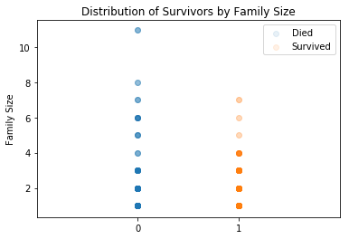

### Import Dependencies


```python
# import dependencies
import pandas as pd
import numpy as np
import time
import matplotlib.pyplot as plt
from sklearn import model_selection,svm,ensemble,gaussian_process,linear_model,naive_bayes,neighbors,tree,discriminant_analysis
from sklearn.preprocessing import OneHotEncoder,LabelEncoder,StandardScaler
from sklearn import metrics
import tensorflow as tf

# shows plots in Jupyter Notebook browser
% matplotlib inline 

#Common Model Algorithms
# from sklearn import svm, tree, linear_model, neighbors, naive_bayes, ensemble, discriminant_analysis, gaussian_process
# from xgboost import XGBClassifier

#Common Model Helpers
# from sklearn.preprocessing import OneHotEncoder, LabelEncoder
# from sklearn import feature_selection
# from sklearn import model_selection
# from sklearn import metrics

#Visualization
# import matplotlib as mpl
# import matplotlib.pyplot as plt
# import matplotlib.pylab as pylab
# import seaborn as sns
# from pandas.tools.plotting import scatter_matrix
```

    C:\Users\Selim\Anaconda3\envs\tfenv\lib\site-packages\h5py\__init__.py:36: FutureWarning: Conversion of the second argument of issubdtype from `float` to `np.floating` is deprecated. In future, it will be treated as `np.float64 == np.dtype(float).type`.
      from ._conv import register_converters as _register_converters
    

### Load Data


```python
# read csv data files
data_train_raw = pd.read_csv('./dataset/train.csv')
data_test_raw = pd.read_csv('./dataset/test.csv')
data_submission = pd.read_csv('./dataset/gender_submission.csv')

# display training dataset
data_train_raw.head()
```


<div>
<table border="1" class="dataframe">
  <thead>
    <tr style="text-align: right;">
      <th></th>
      <th>PassengerId</th>
      <th>Survived</th>
      <th>Pclass</th>
      <th>Name</th>
      <th>Sex</th>
      <th>Age</th>
      <th>SibSp</th>
      <th>Parch</th>
      <th>Ticket</th>
      <th>Fare</th>
      <th>Cabin</th>
      <th>Embarked</th>
    </tr>
  </thead>
  <tbody>
    <tr>
      <th>0</th>
      <td>1</td>
      <td>0</td>
      <td>3</td>
      <td>Braund, Mr. Owen Harris</td>
      <td>male</td>
      <td>22.0</td>
      <td>1</td>
      <td>0</td>
      <td>A/5 21171</td>
      <td>7.2500</td>
      <td>NaN</td>
      <td>S</td>
    </tr>
    <tr>
      <th>1</th>
      <td>2</td>
      <td>1</td>
      <td>1</td>
      <td>Cumings, Mrs. John Bradley (Florence Briggs Th...</td>
      <td>female</td>
      <td>38.0</td>
      <td>1</td>
      <td>0</td>
      <td>PC 17599</td>
      <td>71.2833</td>
      <td>C85</td>
      <td>C</td>
    </tr>
    <tr>
      <th>2</th>
      <td>3</td>
      <td>1</td>
      <td>3</td>
      <td>Heikkinen, Miss. Laina</td>
      <td>female</td>
      <td>26.0</td>
      <td>0</td>
      <td>0</td>
      <td>STON/O2. 3101282</td>
      <td>7.9250</td>
      <td>NaN</td>
      <td>S</td>
    </tr>
    <tr>
      <th>3</th>
      <td>4</td>
      <td>1</td>
      <td>1</td>
      <td>Futrelle, Mrs. Jacques Heath (Lily May Peel)</td>
      <td>female</td>
      <td>35.0</td>
      <td>1</td>
      <td>0</td>
      <td>113803</td>
      <td>53.1000</td>
      <td>C123</td>
      <td>S</td>
    </tr>
    <tr>
      <th>4</th>
      <td>5</td>
      <td>0</td>
      <td>3</td>
      <td>Allen, Mr. William Henry</td>
      <td>male</td>
      <td>35.0</td>
      <td>0</td>
      <td>0</td>
      <td>373450</td>
      <td>8.0500</td>
      <td>NaN</td>
      <td>S</td>
    </tr>
  </tbody>
</table>
</div>


### Display Feature Info
The raw dataset is far from perfect. As we can see, the Age, Cabin, and Embarked features have missing values.


```python
data_train_raw.info()
```

    <class 'pandas.core.frame.DataFrame'>
    RangeIndex: 891 entries, 0 to 890
    Data columns (total 12 columns):
    PassengerId    891 non-null int64
    Survived       891 non-null int64
    Pclass         891 non-null int64
    Name           891 non-null object
    Sex            891 non-null object
    Age            714 non-null float64
    SibSp          891 non-null int64
    Parch          891 non-null int64
    Ticket         891 non-null object
    Fare           891 non-null float64
    Cabin          204 non-null object
    Embarked       889 non-null object
    dtypes: float64(2), int64(5), object(5)
    memory usage: 83.6+ KB
    

### Drop Non-Value Added Column Features
Since the Cabin feature has a significant number of null values, we decide to exclude this feature from our analysis by dropping the column. In addition, we don't need the PassengerId or Ticket number since neither have an impact on our 'Survived' outcome variable.


```python
df = data_train_raw.copy() # create a copy of the raw dataframe
df.drop(['PassengerId','Cabin','Ticket'],axis=1,inplace=True) # drop two columns
df.isna().sum() # display top of dataframe
```


    Survived      0
    Pclass        0
    Name          0
    Sex           0
    Age         177
    SibSp         0
    Parch         0
    Fare          0
    Embarked      2
    dtype: int64


### Impute Missing Values in Dataset
The Age and Embarked features have 177 and 2 missing values respectively. We don't want to drop 177 training examples from our dataset, so we'll impute the missing Age values with the median. We'll impute the 2 missing Embarked values with its mode.


```python
df.Age.fillna(df.Age.median(),inplace=True) # fill in with the median age (in this case, 28.0)
df.Embarked.fillna(df.Embarked.mode()[0],inplace=True) # fill in with the most common embarkment location
df.isna().sum() # check to see if there are anymore na's
```


    Survived    0
    Pclass      0
    Name        0
    Sex         0
    Age         0
    SibSp       0
    Parch       0
    Fare        0
    Embarked    0
    dtype: int64


### Feature Engineering


```python
df['Title'] = df.Name.str.split(', ',expand=True)[1].str.split('.',expand=True)[0] # retrieve persons title from the Name column
df['FamilySize'] = df.SibSp + df.Parch + 1 # calculate family size by summing up the number of Siblings/Spouses and Parents/Children on board, plus the individual themselves
df['IsAlone'] = 0 # create new IsAlone column and set to zero
df.IsAlone[df.FamilySize == 1] = 1 # if family size is 1, this individual is on the ship by themselves
df['FareBin'] = pd.qcut(df.Fare,4) # pandas segregates the Fare feature into 4 evenly split quartiles
df['AgeBin'] = pd.cut(df.Age.astype(int),5) # pandas segregates the Age feature into 5 evenly split age groups 
df.Title.value_counts()
```

    C:\Users\Selim\Anaconda3\envs\tfenv\lib\site-packages\ipykernel_launcher.py:4: SettingWithCopyWarning: 
    A value is trying to be set on a copy of a slice from a DataFrame
    
    See the caveats in the documentation: http://pandas.pydata.org/pandas-docs/stable/indexing.html#indexing-view-versus-copy
      after removing the cwd from sys.path.
    


    Mr              517
    Miss            182
    Mrs             125
    Master           40
    Dr                7
    Rev               6
    Col               2
    Major             2
    Mlle              2
    Mme               1
    Lady              1
    the Countess      1
    Don               1
    Capt              1
    Sir               1
    Jonkheer          1
    Ms                1
    Name: Title, dtype: int64


```python
# group Titles that have less than 10 instances as 'Misc'
title_check = df.Title.value_counts() < 10
df.Title = df.Title.apply(lambda x: 'Misc' if title_check[x] == True else x)
df.Title.value_counts()
```


    Mr        517
    Miss      182
    Mrs       125
    Master     40
    Misc       27
    Name: Title, dtype: int64


### Encode Categorical Features


```python
label = LabelEncoder()
df['Sex_Code'] = label.fit_transform(df.Sex)
df['Embarked_Code'] = label.fit_transform(df.Embarked)
df['Title_Code'] = label.fit_transform(df.Title)
df['Fare_Code'] = label.fit_transform(df.FareBin)
df['Age_Code'] = label.fit_transform(df.AgeBin)
df.head()
```


<div>
<table border="1" class="dataframe">
  <thead>
    <tr style="text-align: right;">
      <th></th>
      <th>Survived</th>
      <th>Pclass</th>
      <th>Name</th>
      <th>Sex</th>
      <th>Age</th>
      <th>SibSp</th>
      <th>Parch</th>
      <th>Fare</th>
      <th>Embarked</th>
      <th>Title</th>
      <th>FamilySize</th>
      <th>IsAlone</th>
      <th>FareBin</th>
      <th>AgeBin</th>
      <th>Sex_Code</th>
      <th>Embarked_Code</th>
      <th>Title_Code</th>
      <th>Fare_Code</th>
      <th>Age_Code</th>
    </tr>
  </thead>
  <tbody>
    <tr>
      <th>0</th>
      <td>0</td>
      <td>3</td>
      <td>Braund, Mr. Owen Harris</td>
      <td>male</td>
      <td>22.0</td>
      <td>1</td>
      <td>0</td>
      <td>7.2500</td>
      <td>S</td>
      <td>Mr</td>
      <td>2</td>
      <td>0</td>
      <td>(-0.001, 7.91]</td>
      <td>(16.0, 32.0]</td>
      <td>1</td>
      <td>2</td>
      <td>3</td>
      <td>0</td>
      <td>1</td>
    </tr>
    <tr>
      <th>1</th>
      <td>1</td>
      <td>1</td>
      <td>Cumings, Mrs. John Bradley (Florence Briggs Th...</td>
      <td>female</td>
      <td>38.0</td>
      <td>1</td>
      <td>0</td>
      <td>71.2833</td>
      <td>C</td>
      <td>Mrs</td>
      <td>2</td>
      <td>0</td>
      <td>(31.0, 512.329]</td>
      <td>(32.0, 48.0]</td>
      <td>0</td>
      <td>0</td>
      <td>4</td>
      <td>3</td>
      <td>2</td>
    </tr>
    <tr>
      <th>2</th>
      <td>1</td>
      <td>3</td>
      <td>Heikkinen, Miss. Laina</td>
      <td>female</td>
      <td>26.0</td>
      <td>0</td>
      <td>0</td>
      <td>7.9250</td>
      <td>S</td>
      <td>Miss</td>
      <td>1</td>
      <td>1</td>
      <td>(7.91, 14.454]</td>
      <td>(16.0, 32.0]</td>
      <td>0</td>
      <td>2</td>
      <td>2</td>
      <td>1</td>
      <td>1</td>
    </tr>
    <tr>
      <th>3</th>
      <td>1</td>
      <td>1</td>
      <td>Futrelle, Mrs. Jacques Heath (Lily May Peel)</td>
      <td>female</td>
      <td>35.0</td>
      <td>1</td>
      <td>0</td>
      <td>53.1000</td>
      <td>S</td>
      <td>Mrs</td>
      <td>2</td>
      <td>0</td>
      <td>(31.0, 512.329]</td>
      <td>(32.0, 48.0]</td>
      <td>0</td>
      <td>2</td>
      <td>4</td>
      <td>3</td>
      <td>2</td>
    </tr>
    <tr>
      <th>4</th>
      <td>0</td>
      <td>3</td>
      <td>Allen, Mr. William Henry</td>
      <td>male</td>
      <td>35.0</td>
      <td>0</td>
      <td>0</td>
      <td>8.0500</td>
      <td>S</td>
      <td>Mr</td>
      <td>1</td>
      <td>1</td>
      <td>(7.91, 14.454]</td>
      <td>(32.0, 48.0]</td>
      <td>1</td>
      <td>2</td>
      <td>3</td>
      <td>1</td>
      <td>2</td>
    </tr>
  </tbody>
</table>
</div>


### Remove Redundant Features


```python
# drop irrelvant and redundant feature columns
df_numerical = df.drop(labels=['Name','Sex','Title','Age','Embarked','Fare','FareBin','AgeBin'],axis=1).copy()
df_numerical.head()
```


<div>
<table border="1" class="dataframe">
  <thead>
    <tr style="text-align: right;">
      <th></th>
      <th>Survived</th>
      <th>Pclass</th>
      <th>SibSp</th>
      <th>Parch</th>
      <th>FamilySize</th>
      <th>IsAlone</th>
      <th>Sex_Code</th>
      <th>Embarked_Code</th>
      <th>Title_Code</th>
      <th>Fare_Code</th>
      <th>Age_Code</th>
    </tr>
  </thead>
  <tbody>
    <tr>
      <th>0</th>
      <td>0</td>
      <td>3</td>
      <td>1</td>
      <td>0</td>
      <td>2</td>
      <td>0</td>
      <td>1</td>
      <td>2</td>
      <td>3</td>
      <td>0</td>
      <td>1</td>
    </tr>
    <tr>
      <th>1</th>
      <td>1</td>
      <td>1</td>
      <td>1</td>
      <td>0</td>
      <td>2</td>
      <td>0</td>
      <td>0</td>
      <td>0</td>
      <td>4</td>
      <td>3</td>
      <td>2</td>
    </tr>
    <tr>
      <th>2</th>
      <td>1</td>
      <td>3</td>
      <td>0</td>
      <td>0</td>
      <td>1</td>
      <td>1</td>
      <td>0</td>
      <td>2</td>
      <td>2</td>
      <td>1</td>
      <td>1</td>
    </tr>
    <tr>
      <th>3</th>
      <td>1</td>
      <td>1</td>
      <td>1</td>
      <td>0</td>
      <td>2</td>
      <td>0</td>
      <td>0</td>
      <td>2</td>
      <td>4</td>
      <td>3</td>
      <td>2</td>
    </tr>
    <tr>
      <th>4</th>
      <td>0</td>
      <td>3</td>
      <td>0</td>
      <td>0</td>
      <td>1</td>
      <td>1</td>
      <td>1</td>
      <td>2</td>
      <td>3</td>
      <td>1</td>
      <td>2</td>
    </tr>
  </tbody>
</table>
</div>


### Compute Correlation Matrix


```python
# compute correlation matrix
corr = df_numerical.corr()
corr
```


<div>
<table border="1" class="dataframe">
  <thead>
    <tr style="text-align: right;">
      <th></th>
      <th>Survived</th>
      <th>Pclass</th>
      <th>SibSp</th>
      <th>Parch</th>
      <th>FamilySize</th>
      <th>IsAlone</th>
      <th>Sex_Code</th>
      <th>Embarked_Code</th>
      <th>Title_Code</th>
      <th>Fare_Code</th>
      <th>Age_Code</th>
    </tr>
  </thead>
  <tbody>
    <tr>
      <th>Survived</th>
      <td>1.000000</td>
      <td>-0.338481</td>
      <td>-0.035322</td>
      <td>0.081629</td>
      <td>0.016639</td>
      <td>-0.203367</td>
      <td>-0.543351</td>
      <td>-0.167675</td>
      <td>-0.083292</td>
      <td>0.299357</td>
      <td>-0.044492</td>
    </tr>
    <tr>
      <th>Pclass</th>
      <td>-0.338481</td>
      <td>1.000000</td>
      <td>0.083081</td>
      <td>0.018443</td>
      <td>0.065997</td>
      <td>0.135207</td>
      <td>0.131900</td>
      <td>0.162098</td>
      <td>-0.035538</td>
      <td>-0.634271</td>
      <td>-0.358005</td>
    </tr>
    <tr>
      <th>SibSp</th>
      <td>-0.035322</td>
      <td>0.083081</td>
      <td>1.000000</td>
      <td>0.414838</td>
      <td>0.890712</td>
      <td>-0.584471</td>
      <td>-0.114631</td>
      <td>0.068230</td>
      <td>-0.243463</td>
      <td>0.393025</td>
      <td>-0.218846</td>
    </tr>
    <tr>
      <th>Parch</th>
      <td>0.081629</td>
      <td>0.018443</td>
      <td>0.414838</td>
      <td>1.000000</td>
      <td>0.783111</td>
      <td>-0.583398</td>
      <td>-0.245489</td>
      <td>0.039798</td>
      <td>-0.119511</td>
      <td>0.393881</td>
      <td>-0.134014</td>
    </tr>
    <tr>
      <th>FamilySize</th>
      <td>0.016639</td>
      <td>0.065997</td>
      <td>0.890712</td>
      <td>0.783111</td>
      <td>1.000000</td>
      <td>-0.690922</td>
      <td>-0.200988</td>
      <td>0.066516</td>
      <td>-0.226104</td>
      <td>0.465396</td>
      <td>-0.216525</td>
    </tr>
    <tr>
      <th>IsAlone</th>
      <td>-0.203367</td>
      <td>0.135207</td>
      <td>-0.584471</td>
      <td>-0.583398</td>
      <td>-0.690922</td>
      <td>1.000000</td>
      <td>0.303646</td>
      <td>0.063532</td>
      <td>0.049212</td>
      <td>-0.560279</td>
      <td>0.124650</td>
    </tr>
    <tr>
      <th>Sex_Code</th>
      <td>-0.543351</td>
      <td>0.131900</td>
      <td>-0.114631</td>
      <td>-0.245489</td>
      <td>-0.200988</td>
      <td>0.303646</td>
      <td>1.000000</td>
      <td>0.108262</td>
      <td>-0.027292</td>
      <td>-0.243613</td>
      <td>0.071125</td>
    </tr>
    <tr>
      <th>Embarked_Code</th>
      <td>-0.167675</td>
      <td>0.162098</td>
      <td>0.068230</td>
      <td>0.039798</td>
      <td>0.066516</td>
      <td>0.063532</td>
      <td>0.108262</td>
      <td>1.000000</td>
      <td>0.029972</td>
      <td>-0.098593</td>
      <td>-0.001528</td>
    </tr>
    <tr>
      <th>Title_Code</th>
      <td>-0.083292</td>
      <td>-0.035538</td>
      <td>-0.243463</td>
      <td>-0.119511</td>
      <td>-0.226104</td>
      <td>0.049212</td>
      <td>-0.027292</td>
      <td>0.029972</td>
      <td>1.000000</td>
      <td>-0.069670</td>
      <td>0.318959</td>
    </tr>
    <tr>
      <th>Fare_Code</th>
      <td>0.299357</td>
      <td>-0.634271</td>
      <td>0.393025</td>
      <td>0.393881</td>
      <td>0.465396</td>
      <td>-0.560279</td>
      <td>-0.243613</td>
      <td>-0.098593</td>
      <td>-0.069670</td>
      <td>1.000000</td>
      <td>0.100508</td>
    </tr>
    <tr>
      <th>Age_Code</th>
      <td>-0.044492</td>
      <td>-0.358005</td>
      <td>-0.218846</td>
      <td>-0.134014</td>
      <td>-0.216525</td>
      <td>0.124650</td>
      <td>0.071125</td>
      <td>-0.001528</td>
      <td>0.318959</td>
      <td>0.100508</td>
      <td>1.000000</td>
    </tr>
  </tbody>
</table>
</div>


### 'Survived' Correlation Results


```python
pd.concat([corr.Survived,corr.Survived.abs().rank(ascending=False)],keys=['Survived Correlation','Rank'],axis=1).sort_values(by=['Rank'])
```


<div>
<table border="1" class="dataframe">
  <thead>
    <tr style="text-align: right;">
      <th></th>
      <th>Survived Correlation</th>
      <th>Rank</th>
    </tr>
  </thead>
  <tbody>
    <tr>
      <th>Survived</th>
      <td>1.000000</td>
      <td>1.0</td>
    </tr>
    <tr>
      <th>Sex_Code</th>
      <td>-0.543351</td>
      <td>2.0</td>
    </tr>
    <tr>
      <th>Pclass</th>
      <td>-0.338481</td>
      <td>3.0</td>
    </tr>
    <tr>
      <th>Fare_Code</th>
      <td>0.299357</td>
      <td>4.0</td>
    </tr>
    <tr>
      <th>IsAlone</th>
      <td>-0.203367</td>
      <td>5.0</td>
    </tr>
    <tr>
      <th>Embarked_Code</th>
      <td>-0.167675</td>
      <td>6.0</td>
    </tr>
    <tr>
      <th>Title_Code</th>
      <td>-0.083292</td>
      <td>7.0</td>
    </tr>
    <tr>
      <th>Parch</th>
      <td>0.081629</td>
      <td>8.0</td>
    </tr>
    <tr>
      <th>Age_Code</th>
      <td>-0.044492</td>
      <td>9.0</td>
    </tr>
    <tr>
      <th>SibSp</th>
      <td>-0.035322</td>
      <td>10.0</td>
    </tr>
    <tr>
      <th>FamilySize</th>
      <td>0.016639</td>
      <td>11.0</td>
    </tr>
  </tbody>
</table>
</div>


## Exploratory Data Analysis

#### Boolean Masks


```python
# define the data masks (filters) that we're interested in
mask_male = df.Sex == 'male'
mask_female = df.Sex == 'female'
mask_survived = df.Survived == 1
mask_died = df.Survived == 0
mask_lowerclass = (df.Pclass == 2) | (df.Pclass == 3)
mask_upperclass = df.Pclass == 1
```

#### Initial Explorartion
We explore the percentage of survivors in each feature category.


```python
x_cols = ['Sex','Pclass','Embarked','Title','FamilySize','IsAlone','Fare_Code','Age_Code']
for col_name in x_cols:
    print(df[[col_name,'Survived']].groupby(col_name).mean())
    print('-'*20)
```

            Survived
    Sex             
    female  0.742038
    male    0.188908
    --------------------
            Survived
    Pclass          
    1       0.629630
    2       0.472826
    3       0.242363
    --------------------
              Survived
    Embarked          
    C         0.553571
    Q         0.389610
    S         0.339009
    --------------------
            Survived
    Title           
    Master  0.575000
    Misc    0.444444
    Miss    0.697802
    Mr      0.156673
    Mrs     0.792000
    --------------------
                Survived
    FamilySize          
    1           0.303538
    2           0.552795
    3           0.578431
    4           0.724138
    5           0.200000
    6           0.136364
    7           0.333333
    8           0.000000
    11          0.000000
    --------------------
             Survived
    IsAlone          
    0        0.505650
    1        0.303538
    --------------------
               Survived
    Fare_Code          
    0          0.197309
    1          0.303571
    2          0.454955
    3          0.581081
    --------------------
              Survived
    Age_Code          
    0         0.550000
    1         0.344762
    2         0.403226
    3         0.434783
    4         0.090909
    --------------------
    


```python
fig = plt.figure(figsize=(20,6))

fig.add_subplot(131)
df.Age.plot(kind='box',title='Age')

fig.add_subplot(132)
plt.ylabel('Fare ($)')
df.Fare.plot(kind='box',title='Fare')

fig.add_subplot(133)
df.FamilySize.plot(kind='box',title='Family Size')
```


    <matplotlib.axes._subplots.AxesSubplot at 0x1d5bd680080>


```python
plt.scatter(df.Survived[mask_died],df.FamilySize[mask_died],alpha=0.1,label='Died')
plt.scatter(df.Survived[mask_survived],df.FamilySize[mask_survived],alpha=0.1,label='Survived')
plt.ylabel('Family Size')
plt.legend()
plt.xticks([0,1])
plt.xlim(-1,2)
plt.title('Distribution of Survivors by Family Size')
# plt.tick_params(size=10)
```


    Text(0.5,1,'Distribution of Survivors by Family Size')





#### EDA - Sex and Pclasses


```python
fig = plt.figure(figsize=(20,13))
alpha_value = 0.6

# survival distribution (plot) - all
ax1 = fig.add_subplot(331)
df.Survived.value_counts().plot(kind='bar',alpha=alpha_value)
plt.title('Survival Distribution - All (Survived: 1)')

ax2 = fig.add_subplot(332)
df.Survived[mask_lowerclass].value_counts().plot(kind='bar',alpha=alpha_value)
plt.title('Survival Distribution - All - Lower Class (Survived: 1)')

ax3 = fig.add_subplot(333)
df.Survived[mask_upperclass].value_counts()[::-1].plot(kind='bar',alpha=alpha_value)
plt.title('Survival Distribution - All - Upper Class (Survived: 1)')

# fig = plt.figure(figsize=(20,5))

# survival distribution (plot) - female
ax4 = fig.add_subplot(334)
df.Survived[mask_female].value_counts()[::-1].plot(kind='bar',alpha=alpha_value)
plt.title('Survival Distribution - Female (Survived: 1)')

ax5 = fig.add_subplot(335)
df.Survived[mask_female & mask_lowerclass].value_counts()[::-1].plot(kind='bar',alpha=alpha_value)
plt.title('Survival Distribution - Female - Lower Class (Survived: 1)')

ax6 = fig.add_subplot(336)
df.Survived[mask_female & mask_upperclass].value_counts()[::-1].plot(kind='bar',alpha=alpha_value)
plt.title('Survival Distribution - Female - Upper Class (Survived: 1)')

# fig = plt.figure(figsize=(20,5))

# survival distribution (plot) - male
ax7 = fig.add_subplot(337)
df.Survived[mask_male].value_counts().plot(kind='bar',alpha=alpha_value)
plt.title('Survival Distribution - Male (Survived: 1)')

ax8 = fig.add_subplot(338)
df.Survived[mask_male & mask_lowerclass].value_counts().plot(kind='bar',alpha=alpha_value)
plt.title('Survival Distribution - Male - Lower Class (Survived: 1)')

ax9 = fig.add_subplot(339)
df.Survived[mask_male & mask_upperclass].value_counts().plot(kind='bar',alpha=alpha_value)
plt.title('Survival Distribution - Male - Upper Class (Survived: 1)')
```


    Text(0.5,1,'Survival Distribution - Male - Upper Class (Survived: 1)')


* **All passengers had a 38.9% (340 out of 889) chance of surviving**
* **Lower-class (pclass = 2 or 3) passengers had a 30.5% (206 out of 675) chance of surviving**
* **Upper-class (pclass = 1) passengers had a 62.6% (134 out of 214) chance of surviving**


* **Female passengers had a 74.0% (231 out of 312) chance of surviving**
* **Lower-class (pclass = 2 or 3) female passengers had a 64.5% (142 out of 220) chance of surviving**
* **Upper-class (pclass = 1) female passengers had a 96.7% (89 out of 92) chance of surviving**


* **Male passengers had a 18.9% (109 out of 577) chance of surviving**
* **Lower-class (pclass = 2 or 3) male passengers had a 14.0% (64 out of 455) chance of surviving**
* **Upper-class (pclass = 1) male passengers had a 36.9% (45 out of 122) chance of surviving**

#### EDA - Age Distribution of Survivors


```python
plt.figure(figsize=(20,5))
df.Age[mask_died].plot(kind='kde',label='Died',alpha=alpha_value)
df.Age[mask_survived].plot(kind='kde',label='Survived',grid=True,alpha=alpha_value)
plt.xlim([0,80])
plt.xlabel('Age')
plt.legend()
plt.title('Age Distribution of Survivors')
```


    Text(0.5,1,'Age Distribution of Survivors')


#### Age Distribution of Pclasses


```python
plt.figure(figsize=(20,5))
df.Age[df.Pclass == 1].plot(kind='kde',alpha=0.7,label='Pclass1')
df.Age[df.Pclass == 2].plot(kind='kde',alpha=0.7,label='Pclass2')
df.Age[df.Pclass == 3].plot(kind='kde',alpha=0.7,label='Pclass3',grid=True)
plt.title('Age Distribution of Pclasses')
plt.xlabel('Age')
plt.legend()
```


    <matplotlib.legend.Legend at 0x1d5bdf8ff98>


#### EDA - Age, Sex, and Pclass


```python
fig = plt.figure(figsize=(20,20))

ax1 = fig.add_subplot(331)
df.Age[mask_died & (df.Pclass == 1)].plot(kind='hist',label='Died',alpha=alpha_value)
df.Age[mask_survived & (df.Pclass == 1)].plot(kind='hist',label='Survived',alpha=alpha_value)
plt.xlabel('Age')
plt.title('Age Distribution of Survivors in Pclass = 1')
plt.legend()

ax2 = fig.add_subplot(332)
df.Age[mask_died & (df.Pclass == 2)].plot(kind='hist',label='Died',alpha=alpha_value)
df.Age[mask_survived & (df.Pclass == 2)].plot(kind='hist',label='Survived',alpha=alpha_value)
plt.xlabel('Age')
plt.title('Age Distribution of Survivors in Pclass = 2')
plt.legend()

ax3 = fig.add_subplot(333)
df.Age[mask_died & (df.Pclass == 3)].plot(kind='hist',label='Died',alpha=alpha_value)
df.Age[mask_survived & (df.Pclass == 3)].plot(kind='hist',label='Survived',alpha=alpha_value)
plt.xlabel('Age')
plt.title('Age Distribution of Survivors in Pclass = 3')
plt.legend()

ax4 = fig.add_subplot(334)
df.Age[mask_female & mask_died & (df.Pclass == 1)].plot(kind='hist',label='Died',alpha=alpha_value)
df.Age[mask_female & mask_survived & (df.Pclass == 1)].plot(kind='hist',label='Survived',alpha=alpha_value)
plt.xlabel('Age')
plt.title('Age Distribution of Female Survivors in Pclass = 1')
plt.legend()

ax5 = fig.add_subplot(335)
df.Age[mask_female & mask_died & (df.Pclass == 2)].plot(kind='hist',label='Died',alpha=alpha_value)
df.Age[mask_female & mask_survived & (df.Pclass == 2)].plot(kind='hist',label='Survived',alpha=alpha_value)
plt.xlabel('Age')
plt.title('Age Distribution of Female Survivors in Pclass = 2')
plt.legend()

ax6 = fig.add_subplot(336)
df.Age[mask_female & mask_died & (df.Pclass == 3)].plot(kind='hist',label='Died',alpha=alpha_value)
df.Age[mask_female & mask_survived & (df.Pclass == 3)].plot(kind='hist',label='Survived',alpha=alpha_value)
plt.xlabel('Age')
plt.title('Age Distribution of Female Survivors in Pclass = 3')
plt.legend()

ax7 = fig.add_subplot(337)
df.Age[mask_male & mask_died & (df.Pclass == 1)].plot(kind='hist',label='Died',alpha=alpha_value)
df.Age[mask_male & mask_survived & (df.Pclass == 1)].plot(kind='hist',label='Survived',alpha=alpha_value)
plt.xlabel('Age')
plt.title('Age Distribution of Male Survivors in Pclass = 1')
plt.legend()

ax8 = fig.add_subplot(338)
df.Age[mask_male & mask_died & (df.Pclass == 2)].plot(kind='hist',label='Died',alpha=alpha_value)
df.Age[mask_male & mask_survived & (df.Pclass == 2)].plot(kind='hist',label='Survived',alpha=alpha_value)
plt.xlabel('Age')
plt.title('Age Distribution of Male Survivors in Pclass = 2')
plt.legend()

ax9 = fig.add_subplot(339)
df.Age[mask_male & mask_died & (df.Pclass == 3)].plot(kind='hist',label='Died',alpha=alpha_value)
df.Age[mask_male & mask_survived & (df.Pclass == 3)].plot(kind='hist',label='Survived',alpha=alpha_value)
plt.xlabel('Age')
plt.title('Age Distribution of Male Survivors in Pclass = 3')
plt.legend()
# plt.tight_layout()
```


    <matplotlib.legend.Legend at 0x1d5bd996a20>


# Build a Model

### Select Relevant Features


```python
x_cols = ['Pclass','Age','Fare','SibSp','Parch','FamilySize','IsAlone','Sex_Code','Embarked_Code','Title_Code','Fare_Code','Age_Code']
x_cols_mod = ['Pclass','SibSp','Parch','FamilySize','IsAlone','Sex_Code','Embarked_Code','Title_Code','Fare_Code','Age_Code']
y_cols = ['Survived']
X = df[x_cols]
X_mod = df[x_cols_mod]
y = df[y_cols]
print('Length of X: {}, Length of y: {}'.format(len(X),len(y)))
X.head()
```

    Length of X: 891, Length of y: 891
    


<div>
<table border="1" class="dataframe">
  <thead>
    <tr style="text-align: right;">
      <th></th>
      <th>Pclass</th>
      <th>Age</th>
      <th>Fare</th>
      <th>SibSp</th>
      <th>Parch</th>
      <th>FamilySize</th>
      <th>IsAlone</th>
      <th>Sex_Code</th>
      <th>Embarked_Code</th>
      <th>Title_Code</th>
      <th>Fare_Code</th>
      <th>Age_Code</th>
    </tr>
  </thead>
  <tbody>
    <tr>
      <th>0</th>
      <td>3</td>
      <td>22.0</td>
      <td>7.2500</td>
      <td>1</td>
      <td>0</td>
      <td>2</td>
      <td>0</td>
      <td>1</td>
      <td>2</td>
      <td>3</td>
      <td>0</td>
      <td>1</td>
    </tr>
    <tr>
      <th>1</th>
      <td>1</td>
      <td>38.0</td>
      <td>71.2833</td>
      <td>1</td>
      <td>0</td>
      <td>2</td>
      <td>0</td>
      <td>0</td>
      <td>0</td>
      <td>4</td>
      <td>3</td>
      <td>2</td>
    </tr>
    <tr>
      <th>2</th>
      <td>3</td>
      <td>26.0</td>
      <td>7.9250</td>
      <td>0</td>
      <td>0</td>
      <td>1</td>
      <td>1</td>
      <td>0</td>
      <td>2</td>
      <td>2</td>
      <td>1</td>
      <td>1</td>
    </tr>
    <tr>
      <th>3</th>
      <td>1</td>
      <td>35.0</td>
      <td>53.1000</td>
      <td>1</td>
      <td>0</td>
      <td>2</td>
      <td>0</td>
      <td>0</td>
      <td>2</td>
      <td>4</td>
      <td>3</td>
      <td>2</td>
    </tr>
    <tr>
      <th>4</th>
      <td>3</td>
      <td>35.0</td>
      <td>8.0500</td>
      <td>0</td>
      <td>0</td>
      <td>1</td>
      <td>1</td>
      <td>1</td>
      <td>2</td>
      <td>3</td>
      <td>1</td>
      <td>2</td>
    </tr>
  </tbody>
</table>
</div>


### Split the dataset (training/test)


```python
# run model 10x with 60/30 split while intentionally leaving out 10%
# cv_split = model_selection.ShuffleSplit(n_splits=1,test_size=0.3,train_size=0.7,random_state=42)
# incorporate normalization? What is the diff between standard scaler where normalization

# apply standard scaler
X_scaled = StandardScaler().fit_transform(X)

# #split data into training and test set -- this isn't necessary if we use the cross validation split we created above
X_train,X_test,y_train,y_test = model_selection.train_test_split(X_scaled,y,test_size=0.20,random_state=42)
print('Training Sample Size: {}, Testing Samples Size: {}'.format(len(y_train),len(y_test)))
```

    Training Sample Size: 712, Testing Samples Size: 179
    

### Train an SVM Model with Various Parameters


```python
# Set the parameters by cross-validation
# tuned_parameters = {'kernel': ['rbf','linear'], 'gamma': [1e-3, 1e-4],'C': [1, 10, 100]}
clf = svm.SVC(C=1.0,kernel='rbf',degree=3,probability=True)
tune_model = model_selection.cross_validate(clf,X_train,y_train,cv=10)
clf.fit(X_train,y_train)
```

    C:\Users\Selim\Anaconda3\envs\tfenv\lib\site-packages\sklearn\utils\validation.py:578: DataConversionWarning: A column-vector y was passed when a 1d array was expected. Please change the shape of y to (n_samples, ), for example using ravel().
      y = column_or_1d(y, warn=True)
    C:\Users\Selim\Anaconda3\envs\tfenv\lib\site-packages\sklearn\utils\validation.py:578: DataConversionWarning: A column-vector y was passed when a 1d array was expected. Please change the shape of y to (n_samples, ), for example using ravel().
      y = column_or_1d(y, warn=True)
    C:\Users\Selim\Anaconda3\envs\tfenv\lib\site-packages\sklearn\utils\validation.py:578: DataConversionWarning: A column-vector y was passed when a 1d array was expected. Please change the shape of y to (n_samples, ), for example using ravel().
      y = column_or_1d(y, warn=True)
    C:\Users\Selim\Anaconda3\envs\tfenv\lib\site-packages\sklearn\utils\validation.py:578: DataConversionWarning: A column-vector y was passed when a 1d array was expected. Please change the shape of y to (n_samples, ), for example using ravel().
      y = column_or_1d(y, warn=True)
    C:\Users\Selim\Anaconda3\envs\tfenv\lib\site-packages\sklearn\utils\validation.py:578: DataConversionWarning: A column-vector y was passed when a 1d array was expected. Please change the shape of y to (n_samples, ), for example using ravel().
      y = column_or_1d(y, warn=True)
    C:\Users\Selim\Anaconda3\envs\tfenv\lib\site-packages\sklearn\utils\validation.py:578: DataConversionWarning: A column-vector y was passed when a 1d array was expected. Please change the shape of y to (n_samples, ), for example using ravel().
      y = column_or_1d(y, warn=True)
    C:\Users\Selim\Anaconda3\envs\tfenv\lib\site-packages\sklearn\utils\validation.py:578: DataConversionWarning: A column-vector y was passed when a 1d array was expected. Please change the shape of y to (n_samples, ), for example using ravel().
      y = column_or_1d(y, warn=True)
    C:\Users\Selim\Anaconda3\envs\tfenv\lib\site-packages\sklearn\utils\validation.py:578: DataConversionWarning: A column-vector y was passed when a 1d array was expected. Please change the shape of y to (n_samples, ), for example using ravel().
      y = column_or_1d(y, warn=True)
    C:\Users\Selim\Anaconda3\envs\tfenv\lib\site-packages\sklearn\utils\validation.py:578: DataConversionWarning: A column-vector y was passed when a 1d array was expected. Please change the shape of y to (n_samples, ), for example using ravel().
      y = column_or_1d(y, warn=True)
    C:\Users\Selim\Anaconda3\envs\tfenv\lib\site-packages\sklearn\utils\validation.py:578: DataConversionWarning: A column-vector y was passed when a 1d array was expected. Please change the shape of y to (n_samples, ), for example using ravel().
      y = column_or_1d(y, warn=True)
    


    SVC(C=1.0, cache_size=200, class_weight=None, coef0=0.0,
      decision_function_shape='ovr', degree=3, gamma='auto', kernel='rbf',
      max_iter=-1, probability=True, random_state=None, shrinking=True,
      tol=0.001, verbose=False)


### Model Performance


```python
clf.score(X_train,y_train)
```


    0.848314606741573


```python
# display survival probabilities
results_df = pd.DataFrame(clf.predict_proba(X_test),columns=['Died','Survived'])
results_df.head()
```


<div>
<table border="1" class="dataframe">
  <thead>
    <tr style="text-align: right;">
      <th></th>
      <th>Died</th>
      <th>Survived</th>
    </tr>
  </thead>
  <tbody>
    <tr>
      <th>0</th>
      <td>0.445937</td>
      <td>0.554063</td>
    </tr>
    <tr>
      <th>1</th>
      <td>0.855448</td>
      <td>0.144552</td>
    </tr>
    <tr>
      <th>2</th>
      <td>0.856309</td>
      <td>0.143691</td>
    </tr>
    <tr>
      <th>3</th>
      <td>0.110351</td>
      <td>0.889649</td>
    </tr>
    <tr>
      <th>4</th>
      <td>0.204547</td>
      <td>0.795453</td>
    </tr>
  </tbody>
</table>
</div>


### Prepare True Validation Data


```python
# copy raw test data
df_test = data_test_raw.copy()

# drop non-value added column features
df_test.drop(['PassengerId','Cabin','Ticket'],axis=1,inplace=True) # drop two columns

# fill NaN values
df_test.Age.fillna(df_test.Age.median(),inplace=True) # fill in with the median age (in this case, 28.0)
df_test.Fare.fillna(df_test.Fare.median(),inplace=True) # fill in with the median fare price
df_test.Embarked.fillna(df_test.Embarked.mode()[0],inplace=True) # fill in with the most common embarkment location

# feature engineering
df_test['Title'] = df_test.Name.str.split(', ',expand=True)[1].str.split('.',expand=True)[0] # retrieve persons title from the Name column
df_test['FamilySize'] = df_test.SibSp + df_test.Parch + 1 # calculate family size by summing up the number of Siblings/Spouses and Parents/Children on board, plus the individual themselves
df_test['IsAlone'] = 0 # create new IsAlone column and set to zero
df_test.IsAlone[df_test.FamilySize == 1] = 1 # if family size is 1, this individual is on the ship by themselves
df_test['FareBin'] = pd.qcut(df.Fare,4) # pandas segregates the Fare feature into 4 evenly split quartiles
df_test['AgeBin'] = pd.cut(df.Age.astype(int),5) # pandas segregates the Age feature into 5 evenly split age groups 

# group Titles that have less than 10 instances as 'Misc'
title_check = df_test.Title.value_counts() < 10
df_test.Title = df_test.Title.apply(lambda x: 'Misc' if title_check[x] == True else x)

# encode categorical features
label = LabelEncoder()
df_test['Sex_Code'] = label.fit_transform(df_test.Sex)
df_test['Embarked_Code'] = label.fit_transform(df_test.Embarked)
df_test['Title_Code'] = label.fit_transform(df_test.Title)
df_test['Fare_Code'] = label.fit_transform(df_test.FareBin)
df_test['Age_Code'] = label.fit_transform(df_test.AgeBin)

# select relevant feature columns
x_cols = ['Pclass','Age','Fare','SibSp','Parch','FamilySize','IsAlone','Sex_Code','Embarked_Code','Title_Code','Fare_Code','Age_Code']
# x_cols_mod = ['Pclass','SibSp','Parch','FamilySize','IsAlone','Sex_Code','Embarked_Code','Title_Code','Fare_Code','Age_Code']
# y_cols = ['Survived']
X_valid = df_test[x_cols]
X_valid_mod = df_test[x_cols_mod]
# y = df_test[y_cols]
print('Length of X valid: {}'.format(len(X)))
X_valid.head()
```

    Length of X valid: 891
    

    C:\Users\Selim\Anaconda3\envs\tfenv\lib\site-packages\ipykernel_launcher.py:16: SettingWithCopyWarning: 
    A value is trying to be set on a copy of a slice from a DataFrame
    
    See the caveats in the documentation: http://pandas.pydata.org/pandas-docs/stable/indexing.html#indexing-view-versus-copy
      app.launch_new_instance()
    


<div>
<table border="1" class="dataframe">
  <thead>
    <tr style="text-align: right;">
      <th></th>
      <th>Pclass</th>
      <th>Age</th>
      <th>Fare</th>
      <th>SibSp</th>
      <th>Parch</th>
      <th>FamilySize</th>
      <th>IsAlone</th>
      <th>Sex_Code</th>
      <th>Embarked_Code</th>
      <th>Title_Code</th>
      <th>Fare_Code</th>
      <th>Age_Code</th>
    </tr>
  </thead>
  <tbody>
    <tr>
      <th>0</th>
      <td>3</td>
      <td>34.5</td>
      <td>7.8292</td>
      <td>0</td>
      <td>0</td>
      <td>1</td>
      <td>1</td>
      <td>1</td>
      <td>1</td>
      <td>3</td>
      <td>0</td>
      <td>1</td>
    </tr>
    <tr>
      <th>1</th>
      <td>3</td>
      <td>47.0</td>
      <td>7.0000</td>
      <td>1</td>
      <td>0</td>
      <td>2</td>
      <td>0</td>
      <td>0</td>
      <td>2</td>
      <td>4</td>
      <td>3</td>
      <td>2</td>
    </tr>
    <tr>
      <th>2</th>
      <td>2</td>
      <td>62.0</td>
      <td>9.6875</td>
      <td>0</td>
      <td>0</td>
      <td>1</td>
      <td>1</td>
      <td>1</td>
      <td>1</td>
      <td>3</td>
      <td>1</td>
      <td>1</td>
    </tr>
    <tr>
      <th>3</th>
      <td>3</td>
      <td>27.0</td>
      <td>8.6625</td>
      <td>0</td>
      <td>0</td>
      <td>1</td>
      <td>1</td>
      <td>1</td>
      <td>2</td>
      <td>3</td>
      <td>3</td>
      <td>2</td>
    </tr>
    <tr>
      <th>4</th>
      <td>3</td>
      <td>22.0</td>
      <td>12.2875</td>
      <td>1</td>
      <td>1</td>
      <td>3</td>
      <td>0</td>
      <td>0</td>
      <td>2</td>
      <td>4</td>
      <td>1</td>
      <td>2</td>
    </tr>
  </tbody>
</table>
</div>


### Classify True Validation Data


```python
# standardize validation data
X_valid_scaled = StandardScaler().fit_transform(X_valid)

# use classifier to predict survival outcomes
output = clf.predict(X_valid_scaled)
output
```


    array([0, 1, 0, 0, 1, 0, 1, 0, 1, 0, 0, 0, 1, 0, 1, 1, 0, 0, 0, 1, 0, 1,
           1, 0, 1, 0, 1, 0, 0, 0, 0, 0, 1, 1, 0, 0, 1, 1, 0, 0, 0, 0, 0, 1,
           1, 0, 0, 0, 1, 1, 0, 0, 1, 1, 0, 0, 0, 0, 0, 1, 0, 0, 0, 1, 1, 1,
           1, 0, 0, 0, 1, 0, 1, 0, 1, 0, 0, 1, 0, 1, 1, 0, 0, 0, 0, 0, 1, 1,
           1, 1, 1, 0, 1, 0, 0, 0, 1, 0, 1, 0, 1, 0, 0, 0, 1, 0, 0, 0, 0, 0,
           0, 1, 1, 1, 1, 0, 0, 1, 0, 1, 1, 0, 1, 0, 0, 1, 0, 0, 0, 0, 0, 0,
           0, 0, 0, 0, 0, 0, 1, 0, 0, 1, 0, 0, 0, 0, 0, 0, 0, 0, 1, 0, 0, 1,
           0, 0, 1, 1, 0, 1, 1, 1, 1, 0, 0, 1, 0, 0, 1, 1, 0, 0, 0, 0, 0, 1,
           1, 0, 1, 1, 0, 0, 1, 0, 1, 0, 1, 0, 0, 0, 0, 0, 1, 0, 1, 0, 1, 1,
           0, 1, 1, 1, 0, 1, 0, 0, 1, 0, 1, 0, 0, 0, 0, 1, 0, 0, 1, 0, 1, 0,
           1, 0, 1, 0, 1, 1, 0, 1, 0, 0, 0, 1, 0, 0, 0, 0, 0, 0, 1, 1, 1, 1,
           0, 0, 0, 0, 1, 0, 1, 1, 1, 0, 0, 0, 0, 0, 0, 0, 1, 0, 0, 0, 1, 0,
           0, 0, 0, 0, 1, 0, 0, 0, 1, 1, 0, 1, 0, 0, 0, 0, 1, 1, 1, 1, 1, 0,
           0, 0, 0, 0, 0, 1, 0, 0, 0, 0, 1, 0, 0, 0, 0, 0, 0, 0, 1, 1, 0, 1,
           0, 1, 0, 0, 0, 1, 1, 1, 0, 0, 0, 0, 0, 0, 0, 0, 1, 0, 0, 0, 0, 0,
           1, 0, 0, 1, 0, 0, 0, 0, 0, 0, 0, 0, 0, 1, 0, 1, 0, 1, 0, 1, 1, 0,
           0, 0, 0, 0, 1, 0, 0, 1, 0, 1, 1, 0, 1, 0, 0, 1, 1, 0, 0, 1, 0, 0,
           1, 1, 0, 0, 0, 0, 0, 0, 1, 1, 0, 1, 0, 0, 0, 0, 0, 1, 1, 0, 0, 1,
           0, 1, 0, 0, 1, 0, 1, 0, 0, 0, 0, 0, 1, 1, 1, 1, 1, 0, 1, 0, 0, 1],
          dtype=int64)


### Save Output as CSV


```python
pd.DataFrame(output,index=data_test_raw.PassengerId,columns=['Survived']).to_csv('output.csv')
```
